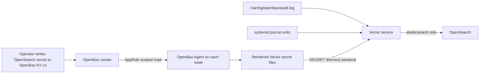

# Design

## Research Summary

Primary source findings:

- Vector's OpenSearch path is the `elasticsearch` sink. It supports
  `opensearch_service_type`, basic auth, AWS auth, TLS settings, bulk mode, and
  OpenSearch compatibility. Source: https://vector.dev/docs/reference/configuration/sinks/elasticsearch/
- Vector's file source can read log files, tracks checkpoints in its data dir,
  and requires the Vector process to read files and execute parent
  directories. Source: https://vector.dev/docs/reference/configuration/sources/file/
- Vector's journald source supports `include_units` and requires journal
  permissions, usually through the `systemd-journal` group when package
  defaults do not cover it. Source: https://vector.dev/docs/reference/configuration/sources/journald/
- Vector's `SECRET[...]` support can read secrets from file or directory
  backends and is preferred over environment variable interpolation. Source:
  https://vector.dev/docs/reference/configuration/secrets/
- OpenBao Agent can auto-authenticate and render multiple templates using
  OpenBao secrets. KV v2 secrets are static from the Agent template renewal
  perspective and are fetched periodically. Source:
  https://openbao.org/docs/agent-and-proxy/agent/template/
- OpenBao Agent AppRole auto-auth reads role ID and secret ID from local files.
  Source: https://openbao.org/docs/2.5.x/agent-and-proxy/autoauth/methods/approle/
- OpenBao AppRole is intended for machine and app authentication with scoped
  policies. Source: https://openbao.org/docs/auth/approle/
- OpenBao KV v2 data paths use the `data/` API prefix for read/write policy
  paths. Source: https://openbao.org/docs/secrets/kv/kv-v2/

## Architecture



The design keeps Vector as a local node agent, not a central aggregator. Each
OpenBao node forwards its own audit and service logs. The OpenBao Agent service
is the bridge from OpenBao secrets to Vector runtime credentials.

## Variable Model

Add defaults in `group_vars/all/openbao_defaults.yml`:

```yaml
openbao_vector_enabled: false
openbao_vector_package_name: vector
openbao_vector_config_dir: /etc/vector
openbao_vector_config_file: "{{ openbao_vector_config_dir }}/vector.yaml"
openbao_vector_data_dir: /var/lib/vector
openbao_vector_secret_dir: "{{ openbao_vector_config_dir }}/openbao-secrets"
openbao_vector_secret_backend_name: openbao_vector
openbao_vector_secret_source: openbao_agent

openbao_vector_collect_audit: true
openbao_vector_collect_journald: true
openbao_vector_journald_units:
  - openbao.service
  - openbao-agent.service

openbao_vector_opensearch_endpoints: []
openbao_vector_opensearch_service_type: managed
openbao_vector_opensearch_index: "openbao-{{ openbao_cluster_name }}-%Y.%m.%d"
openbao_vector_opensearch_auth_strategy: basic
openbao_vector_opensearch_secret_mount: secret
openbao_vector_opensearch_secret_path: observability/opensearch/openbao-vector
openbao_vector_opensearch_username_field: username
openbao_vector_opensearch_password_field: password
openbao_vector_opensearch_tls_ca_file: ""
openbao_vector_validate_sink_health: false

openbao_vector_seed_opensearch_secret: false
openbao_vector_opensearch_secret_data: {}
```

`openbao_vector_opensearch_secret_data` is intentionally empty by default. If
set, it must come from vault or lab-only variables and all tasks using it must
be `no_log: true`.

## Agent Enablement Model

Current defaults tie `openbao_agent_enabled` directly to
`openbao_certificate_mode == 'agent'`. That is too narrow once Agent can render
Vector secrets.

Refactor to separate service enablement from listener certificate renewal:

```yaml
openbao_agent_listener_cert_enabled: "{{ openbao_certificate_mode == 'agent' }}"
openbao_agent_vector_secret_enabled: >-
  {{
    openbao_vector_enabled | bool
    and openbao_vector_secret_source == 'openbao_agent'
  }}
openbao_agent_enabled: >-
  {{
    openbao_agent_listener_cert_enabled | bool
    or openbao_agent_vector_secret_enabled | bool
  }}
```

`openbao_pki_enabled` should remain certificate-renewal specific:

```yaml
openbao_pki_enabled: "{{ openbao_certificate_mode in ['agent', 'native_acme'] }}"
```

Agent identity creation should move out of `roles/openbao_pki` into a reusable
identity task path that can build one AppRole policy from selected capability
fragments:

- listener certificate fragment when `openbao_agent_listener_cert_enabled`
- Vector KV read fragment when `openbao_agent_vector_secret_enabled`

This avoids enabling the PKI role just to create a KV-reading AppRole in
bootstrap certificate mode.

## Vector Role

Create a new `roles/openbao_vector/` role.

Responsibilities:

- Install `openbao_vector_package_name` with `dnf`.
- Ensure Vector config, data, and secret directories exist.
- Ensure the `vector` service user can read:
  - `openbao_audit_log_file` via membership in `openbao_service_group`
  - journal entries via membership in `systemd-journal` when that group exists
  - rendered credential files via ownership `root:vector` and mode `0640`
- Render `/etc/vector/vector.yaml`.
- Validate the rendered config with `vector validate`.
- Enable and start `vector` only after required secret files exist.
- Expose a handler to restart Vector when config changes.

The role must not fetch secrets from OpenBao directly. Secret rendering remains
owned by OpenBao Agent.

## Vector Config Shape

The generated YAML should use Vector's secret directory backend:

```yaml
data_dir: /var/lib/vector

secret:
  openbao_vector:
    type: directory
    path: /etc/vector/openbao-secrets
    remove_trailing_whitespace: true

sources:
  openbao_audit:
    type: file
    include:
      - /var/log/openbao/audit.log
      - /var/log/openbao/audit.log.*
    read_from: beginning

  openbao_journal:
    type: journald
    include_units:
      - openbao.service
      - openbao-agent.service

transforms:
  openbao_audit_shape:
    type: remap
    inputs:
      - openbao_audit
    source: |-
      parsed, err = parse_json(.message)
      if err == null && is_object(parsed) {
        .openbao_audit = parsed
      }
      .openbao_cluster = "openbao-prod"
      .openbao_node = "node1"
      .openbao_log_type = "audit"

  openbao_journal_shape:
    type: remap
    inputs:
      - openbao_journal
    source: |-
      .openbao_cluster = "openbao-prod"
      .openbao_node = "node1"
      .openbao_log_type = "service"
      .openbao_systemd_unit = ._SYSTEMD_UNIT ?? null

sinks:
  opensearch:
    type: elasticsearch
    inputs:
      - openbao_audit_shape
      - openbao_journal_shape
    endpoints:
      - https://opensearch.example.com:9200
    opensearch_service_type: managed
    mode: bulk
    bulk:
      index: openbao-openbao-prod-%Y.%m.%d
    auth:
      strategy: basic
      user: "SECRET[openbao_vector.username]"
      password: "SECRET[openbao_vector.password]"
```

The implementation should generate only enabled sources and transforms. It
should omit `tls.ca_file` unless `openbao_vector_opensearch_tls_ca_file` is set.

## OpenBao Agent Secret Templates

Render two Agent template sources by default:

- `{{ openbao_vector_secret_dir }}/username`
- `{{ openbao_vector_secret_dir }}/password`

The template source should read the KV v2 API path:

```hcl
{{ with secret "secret/data/observability/opensearch/openbao-vector" -}}
{{ index .Data.data "username" }}
{{ end -}}
```

and the password equivalent. Template stanzas should set:

- `destination` to the target file in `openbao_vector_secret_dir`
- `perms = "0640"`
- `error_on_missing_key = true`
- an `exec` hook that validates non-empty files and restarts Vector if Vector
  is installed and active

The Agent systemd unit's `ReadWritePaths` must include
`openbao_vector_secret_dir` when Vector secret rendering is enabled.

## AppRole And Policy

The per-node Agent policy should be built from fragments.

For Vector-only bootstrap mode:

```hcl
path "secret/data/observability/opensearch/openbao-vector" {
  capabilities = ["read"]
}
```

For listener certificate renewal, keep the existing PKI issue capability:

```hcl
path "pki_openbao/issue/openbao-agent-node1" {
  capabilities = ["update"]
}
```

The AppRole artifact fingerprint should include:

- cluster ID
- host
- auth mount
- role name
- policy name
- role ID
- selected policy fragments
- listener certificate SAN fingerprint when listener certificate renewal is
  enabled
- selected Vector secret mount/path/field names when Vector secret rendering is
  enabled

This prevents stale AppRole artifacts from silently carrying the wrong policy
shape.

## Playbook Wiring

`playbooks/site.yml` should keep the current ordering and add Vector where the
cluster is already initialized:

1. Validate selected target.
2. Verify nodes are reachable.
3. Replace existing deployment when requested.
4. Disable OpenBao Agent when no Agent-backed feature is selected.
5. Prepare OpenBao servers and bootstrap the cluster.
6. Configure PKI when certificate renewal is selected.
7. Configure OpenBao Agent AppRole identities when `openbao_agent_enabled`.
8. Converge OpenBao Agent templates.
9. Converge Vector logging when `openbao_vector_enabled`.
10. Run native ACME and final OpenBao validation as today.

`playbooks/upgrade.yml` should not become a Vector management entry point. It
may restart OpenBao Agent after OpenBao package upgrades when
`openbao_agent_enabled`, but Vector configuration changes remain `site.yml`
work.

## Replacement Behavior

Extend `roles/openbao_common/tasks/replace_existing.yml`:

- stop and disable `vector` when the service exists
- remove managed Vector config file and optional drop-ins
- remove `openbao_vector_secret_dir`
- remove `openbao_vector_data_dir`
- preserve installed Vector package, Vector user/group, external repositories,
  OpenSearch, inventory, group vars, vault vars, and uploaded TLS/CA inputs

If replacement reinitializes OpenBao, the KV secret used by Vector is gone too.
Operators must either:

- seed it from vault with `openbao_vector_seed_opensearch_secret=true`, or
- recreate the KV secret manually after initialization and rerun `site.yml`

## Documentation

Update:

- `README.md`: quick enablement, OpenBao KV secret example, and warning about
  replacement.
- `docs/variables.md`: complete variable reference.
- `lab/README.md`: lab OpenSearch/Vector validation path.

## Dependency Decisions

### Vector OS Package

Decision: Approved.

Rationale: Vector is purpose-built for local log collection, journald/file
sources, VRL transforms, and OpenSearch-compatible output. Reimplementing log
tailing, checkpointing, backpressure, batching, TLS, and OpenSearch bulk
delivery in Ansible or shell would be lower quality and harder to operate.

Constraints:

- Install the `vector` OS package with `dnf`.
- Do not execute `curl | bash` from Ansible.
- Do not add `openbao_vector_version` in the first implementation; keep
  package pinning/repository control outside this role unless the operator asks
  to manage Vector repository policy here.
- Document that hosts must have a Vector package repository or local mirror
  available before enabling `openbao_vector_enabled`.

### OpenSearch

Decision: External service, not provisioned by this repository.

Rationale: The OpenBao playbooks should integrate with an existing logging
backend, not own storage lifecycle, index management, dashboards, or backup
policy.

## Security Considerations

- The Vector config must contain `SECRET[...]` references, not plaintext
  credentials.
- Rendered secret files are sensitive and must stay local to the node.
- AppRole policies must be least privilege and per-node.
- The Agent AppRole secret ID artifact under `secure-artifacts/` remains
  sensitive and ignored.
- The role must not fetch rendered Vector secrets to the controller.
- Vector should get log access through group membership/permissions, not root
  execution or broad Linux capabilities.

## Validation Plan

Static:

```bash
ansible-playbook --syntax-check playbooks/site.yml
ansible-playbook --syntax-check playbooks/upgrade.yml
ansible-inventory --graph
ansible-lint
yamllint .
```

Vector config:

```bash
vector validate --skip-healthchecks /etc/vector/vector.yaml
```

Lab:

1. Start lab OpenBao and OpenSearch services.
2. Run `lab/scripts/openbao-lab-playbook.sh site`.
3. Store the OpenSearch credential secret in lab OpenBao or enable vaulted lab
   secret seeding.
4. Run `lab/scripts/openbao-lab-playbook.sh site -e openbao_vector_enabled=true`.
5. Confirm `vector.service` is active on every node.
6. Trigger at least one OpenBao API call that writes an audit event.
7. Query OpenSearch for indexed `openbao_log_type=audit` and
   `openbao_log_type=service` events.
8. Run replacement with `openbao_replace_existing=true` and secret seeding.
9. Confirm repeated replacement finishes healthy and Vector forwards again.

